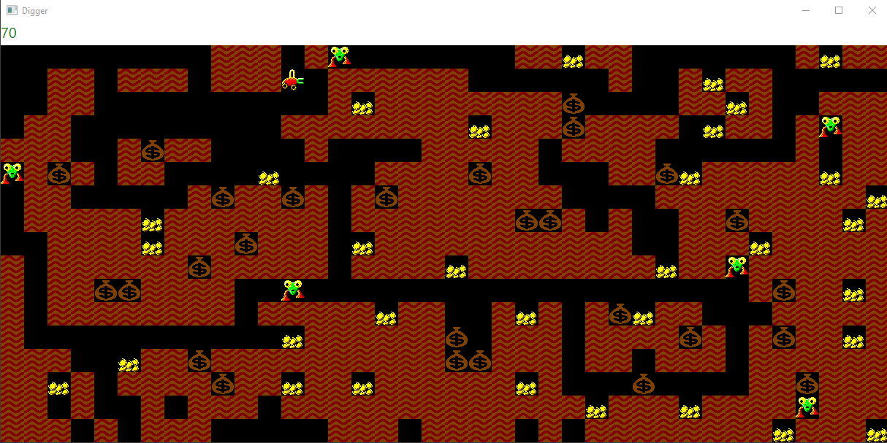

# ⛏️ Digger Reloaded

[](https://docs.microsoft.com/en-us/dotnet/csharp/)
[](https://avaloniaui.net/)


> **Классическая игра Digger, воссозданная с нуля на C# с использованием ООП и Avalonia UI**

---

## 📸 Скриншоты



*Пример игрового процесса: игрок (Digger) копает землю, собирает золото и избегает монстров*

---

## 📖 О проекте

**Digger** — культовая компьютерная игра, бывшая одной из самых продвинутых и увлекательных в своё время. Этот проект представляет собой современную реализацию её механик с использованием объектно-ориентированного подхода и графического фреймворка Avalonia.

Проект создан в учебных целях для демонстрации принципов ООП, работы с игровым циклом, обработки столкновений и управления состоянием игры.

---

## 🎮 Игровая механика

### Персонажи и объекты


| Символ | Объект | Описание |
|:------:|--------|----------|
| `P` | **Digger (Игрок)** | Управляется стрелками. Разрывает землю и собирает золото |
| `T` | **Terrain (Земля)** | Препятствие. Исчезает, когда игрок проходит сквозь неё |
| `S` | **Sack (Мешок)** | Падает вниз при отсутствии опоры. Может раздавить игрока или монстра |
| `G` | **Gold (Золото)** | Появляется при падении мешка с высоты >1 клетки. Даёт +10 очков |
| `M` | **Monster (Монстр)** | Двигается к игроку, избегая земли и мешков. Умирает при столкновении с падающим мешком |

### Особенности

- ✅ Игрок может двигаться в 4 направлениях
- ✅ Земля разрушается под ногами игрока
- ✅ Реалистичная физика падения мешков
- ✅ Мешки превращаются в золото при падении с высоты >1 клетки
- ✅ ИИ монстров с поиском пути к игроку
- ✅ Сложные правила столкновений (кто кого убивает)
- ✅ Множественные монстры могут сталкиваться и погибать

---

## 🗺️ Создание собственной карты

Одна из ключевых возможностей проекта — **вы можете создавать свои карты прямо в коде**!

В файле [`Game.cs`](Game.cs) найдите метод `CreateMap()` и измените карту по своему усмотрению:

```csharp
public static void CreateMap()
{
    // Раскомментируйте нужную карту или создайте свою!
    
    // Простая карта с игроком и землёй
    // Map = CreatureMapCreator.CreateMap(mapWithPlayerTerrain);
    
    // Карта с мешками и золотом
    // Map = CreatureMapCreator.CreateMap(mapWithPlayerTerrainSackGold);
    
    // Полная карта со всеми объектами
    // Map = CreatureMapCreator.CreateMap(mapWithPlayerTerrainSackGoldMonster);
    
    // Своя уникальная карта!
    Map = CreatureMapCreator.CreateMap(@"
PTTGTT TST
TST  TSTTM
TTT TTSTTT
T TSTS TTT
T TTTGMSTS
T TMT M TS
TSTSTTMTTT
S TTST  TG
 TGST MTTT
 T  TMTTTT");
}
```

### Символы для создания карт:


| Символ | Объект |
|:------:|--------|
| **P** | Игрок (Digger) |
| **T** | Земля (Terrain) |
| **S** | Мешок (Sack) |
| **G** | Золото (Gold) |
| **M** | Монстр (Monster) |
| *пробел* | Пустота |

💡 **Подсказка:** Можете использовать многострочные строки с любым количеством строк и столбцов. Главное — чтобы все строки были одинаковой длины!

---

## 🏗️ Архитектура проекта

```text
Digger/
├── Game.cs                 # Основной игровой цикл и создание карт
├── GameState.cs            # Управление состоянием игры
├── Architecture/
│   ├── ICreature.cs        # Интерфейс всех игровых объектов
│   ├── CreatureCommand.cs  # Команда для перемещения/трансформации
│   └── CreatureMapCreator.cs # Парсер карт из текста
├── UI/
│   ├── MainWindow.axaml    # Окно приложения
│   ├── Frame.cs            # Кадр для отрисовки
│   └── Program.cs          # Точка входа
└── Images/                 # Спрайты персонажей
    ├── Digger.png
    ├── Terrain.png
    ├── Sack.png
    ├── Gold.png
    └── Monster.png
```

Каждый игровой объект реализует интерфейс `ICreature`:

```csharp
public interface ICreature
{
    string GetImageFileName();           // Путь к спрайту
    int GetDrawingPriority();            // Приоритет отрисовки
    CreatureCommand Act(int x, int y);   // Действие на ходу
    bool DeadInConflict(ICreature other); // Результат столкновения
}
```

---

## 🚀 Запуск проекта

### Требования

- **.NET 8.0** или выше
- **Avalonia UI** (устанавливается автоматически через NuGet)

### Установка и запуск

```bash
# Клонирование репозитория
git clone https://github.com

# Переход в директорию проекта
cd digger-reloaded

# Восстановление зависимостей
dotnet restore

# Запуск игры
dotnet run
```

---

## 🎯 Управление


| Клавиша | Действие |
|:-------:|----------|
| **←** | Движение влево |
| **→** | Движение вправо |
| **↑** | Движение вверх |
| **↓** | Движение вниз |
| **ESC** | Закрыть игру |

---

## 📊 Система очков

- **Золото** — `+10` очков при сборе.
- Текущий счёт отображается прямо в заголовке игрового окна.

---

## 🧪 Что можно улучшить (идеи для творчества)

Проект открыт для экспериментов! Вот несколько отличных идей:

- ✨ **Новые объекты:** добавить ключи, запертые двери или временные бонусы.
- 🔊 **Звуки:** реализовать эффекты при сборе золота, взрывах или гибели персонажей.
- 📈 **Рекорды:** написать локальную или онлайн таблицу лучших результатов.
- ⏱️ **Таймер:** ограничить время на прохождение уровня.
- 🌟 **Анимация:** оживить спрайты персонажей при движении.
- 🧠 **Умный ИИ:** переписать поиск пути монстров на алгоритм A*.

---

## 📚 Чему посвящён проект

Этот учебный проект наглядно демонстрирует:

- **ООП** — активное использование наследования, полиморфизма и инкапсуляции.
- **Паттерны проектирования** — реализация архитектуры *Command* и *Game Loop*.
- **Avalonia UI** — работа с современным кроссплатформенным UI-фреймворком.
- **События** — перехват и обработка пользовательского ввода с клавиатуры.
- **Алгоритмы** — базовая логика преследования и поиска пути игрока.

---

## 🤝 Вклад в проект

Приветствуются любые пул-реквесты с новыми механиками, улучшениями оптимизации или исправлениями багов!

---

## 📜 Лицензия

Проект распространяется под лицензией [MIT License](LICENSE).

---

## 🙏 Благодарности

- Оригинальной игре **Digger** от *Windmill Software*.
- Команде **Avalonia UI** за отличный кроссплатформенный фреймворк.
- Всем, кто дочитал этот README до самого конца! 😊

<p align="center">
  <i>Копайте глубже, собирайте золото и избегайте монстров!</i>
</p>

---

> 📌 **Примечание:** Чтобы скриншот корректно отображался на GitHub, поместите файл скриншота в корень репозитория под именем `screenshot.png` или измените путь в начале файла на актуальный (например, `docs/screenshot.png`).
